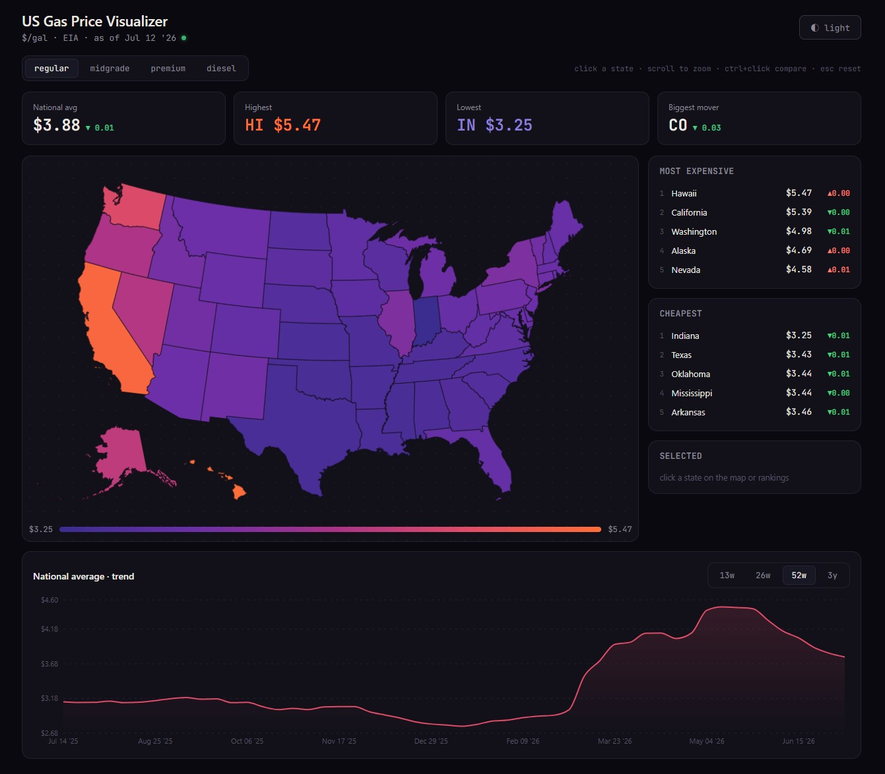
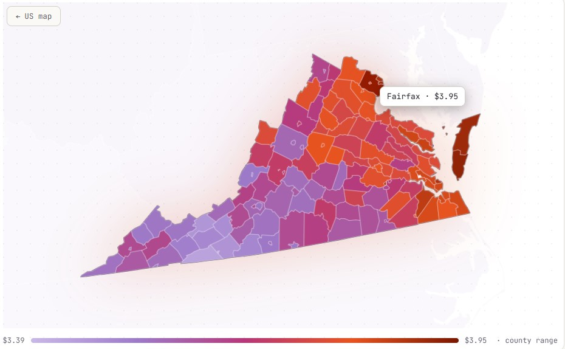
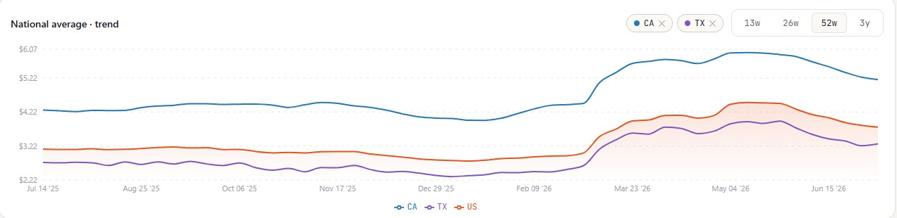
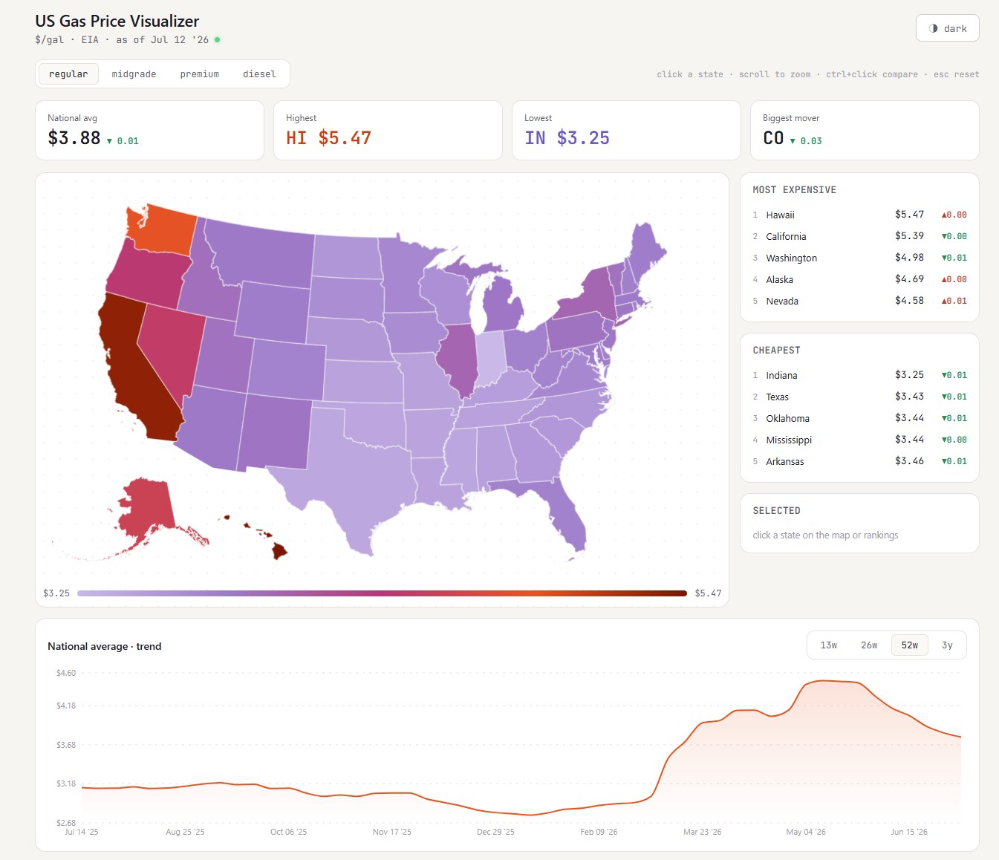

# US Gas Price Visualizer

Full-stack, self-hosted dashboard for US gasoline prices — an interactive
choropleth map with **state → metro → county** drill-down, week/day deltas,
multi-state trend comparison, and a dark "data terminal" aesthetic.

Built with a simple deployment model: **the frontend is always
online, the backend runs on demand on my own machine** and is exposed through a
Cloudflare Tunnel only when a live demo is needed. When the backend is offline,
the frontend degrades to a cached real-data snapshot.

## Screenshots









## Features

- **Interactive US choropleth** (Magma-derived color scale, color-blind safe)
  with cursor-tracked 3D tilt on hover, animated camera fly-in on state
  selection, and scroll-to-zoom in pixel space (safe for the AK/HI insets of
  the AlbersUSA composite projection)
- **Three-level drill-down**: national map → state view with county-level
  choropleth (AAA, independent-city aware name matching) and a metro price
  panel with day-over-day deltas
- **Two data providers, honestly blended**: AAA (daily, all 50 states,
  scraped) powers "now"; EIA (weekly, official API) powers 3.5 years of
  history. The API responds with `provider` and `source` fields so the UI can
  label regional fallbacks instead of passing them off as state data
- Fuel-grade switching (regular / midgrade / premium / diesel), day-over-day
  deltas, biggest-mover card, top-5 rankings, 13w/26w/52w/3y trend ranges,
  ctrl+click multi-state comparison, dark/light themes

## Architecture

```
┌────────────────────────────┐         ┌─────────────────────────────────┐
│ Frontend · always online   │         │ Backend · on-demand, local      │
│ React + TS + Vite (Vercel) │  HTTPS  │ FastAPI + SQLite                │
│  · react-simple-maps + d3  │ ──────► │  · EIA API ingest (weekly)      │
│  · Recharts trends         │ tunnel  │  · AAA scraper (daily, polite)  │
│  · offline snapshot mode   │ ◄────── │  · per-state on-demand caching  │
└────────────────────────────┘         │  · APScheduler auto-refresh     │
                                       └─────────────────────────────────┘
```

- **SQLite** as the storage layer: the backend is single-user and local, so a
  zero-config single-file database is the right-sized choice
- **On-demand scraping with a 24h cache**: metro/county data for a state is
  fetched only when someone actually views that state — one or two requests
  per state per day, far below AAA's `Crawl-delay: 10` robots.txt policy
- **Fail-safe ingestion**: parsers refuse to write when page structure looks
  wrong (state/county count fuses), and every scrape failure falls back to
  the last good data instead of breaking the API

## Data sources & scraping ethics

- [EIA Open Data](https://www.eia.gov/opendata/) — official weekly retail
  gasoline/diesel prices (free API key)
- [AAA Gas Prices](https://gasprices.aaa.com/) — daily state / metro / county
  averages. Scraped in accordance with the site's `robots.txt`
  (crawling allowed, `Crawl-delay: 10` respected with wide margin), with an
  identified User-Agent, minimal request volume, and structure-change fuses.
  County data is regular-grade only because that is all AAA publishes at that
  granularity — the UI hides the county layer for other grades rather than
  estimating values.

## Running locally

Backend (Windows PowerShell):

```powershell
cd backend
python -m venv venv
.\venv\Scripts\Activate.ps1
pip install -r requirements.txt
copy env.example .env          # put your EIA API key inside
python ingest_eia.py --full    # backfill ~3.5 years of weekly data
python ingest_aaa.py           # today's AAA state averages
```

Frontend:

```powershell
npm install
```

Then start both with one command from the project root:

```powershell
.\dev.ps1
```

Frontend: http://localhost:5173 · API docs: http://localhost:8000/docs

## API

| Endpoint | Description |
|---|---|
| `GET /api/health` | liveness + ingest status for both providers |
| `GET /api/prices/latest?product=` | all 50 states, AAA-first with EIA fallback, with deltas |
| `GET /api/prices/history?weeks=&product=` | national weekly series (EIA) |
| `GET /api/prices/state/{abbr}?weeks=&product=` | state series, PADD fallback flagged |
| `GET /api/prices/metros/{abbr}?product=` | metro averages (AAA, on-demand cached) |
| `GET /api/prices/counties/{abbr}` | county averages, regular only (AAA) |
| `GET /api/prices/cities?product=` | EIA metro series (~10 cities) |

## Roadmap

- Persist AAA daily history for county/metro trend lines
- pytest suite + GitHub Actions CI
- Station-level layer for one metro area (evaluating TomTom/HERE free tiers)
